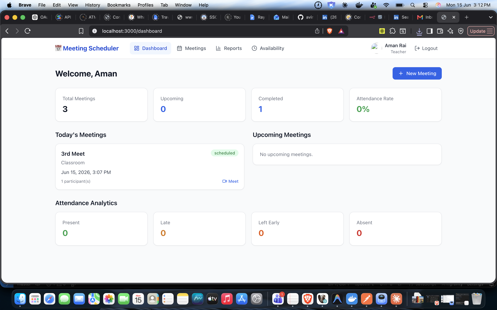
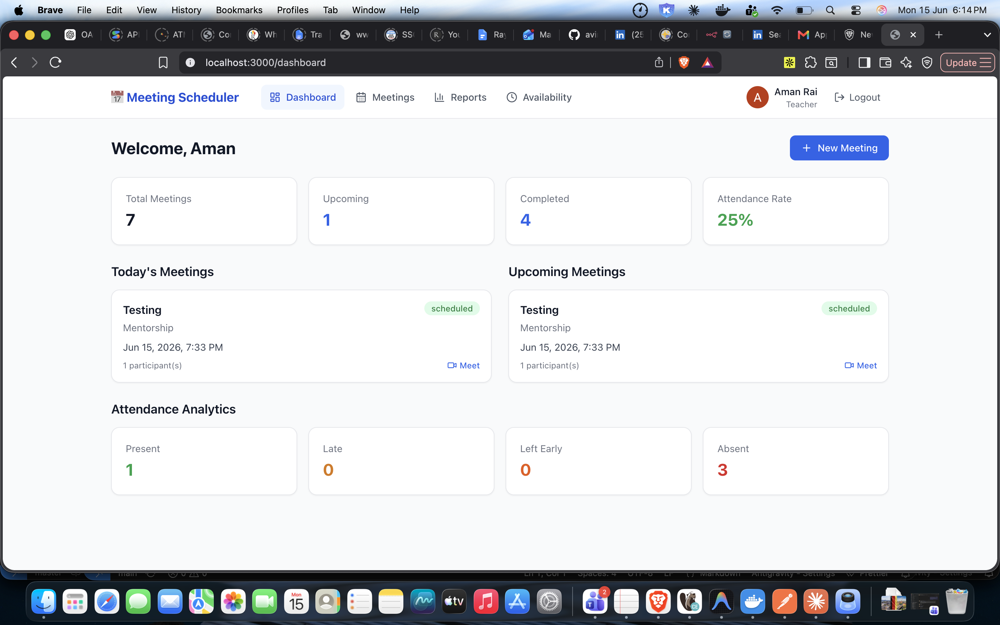

# Teacher Meeting Scheduler & Attendance Management System

A centralized platform to schedule Google Meet meetings, automate calendar management, send invitations and reminders, track attendance, and generate reports — replacing the manual mix of Google Calendar, Meet, Email, and Excel.

---

## 1. Project Overview

**Features**

- **Google OAuth 2.0 login** with JWT sessions (httpOnly cookies) and role-based access control (Teacher / Candidate).
- **First-login role selection** so any user can onboard as a Teacher or Candidate (no email pre-listing needed).
- **Meeting management** — create one-time or recurring meetings; each gets a real **Google Calendar event + auto-generated Google Meet link**; invitations and calendar entries are delivered to participants automatically.
- **Reschedule & cancel** with automatic participant notifications and Google Calendar sync.
- **Conflict detection** against the teacher's working hours, holidays, blocked slots, and existing meetings.
- **Automated reminders** at 24h / 1h / 15min before each meeting (BullMQ + Redis), plus invitation/reschedule/cancellation emails (Nodemailer).
- **Attendance tracking** — in-app join/heartbeat capture *and* Google Workspace Admin Reports sync; status computed as Present / Late / Left Early / Absent.
- **Reports & analytics** — per-meeting and summary analytics, exportable as **PDF and Excel**.
- **Dashboards** for teachers and candidates, with availability management for teachers.
- **Audit logging** of logins, meeting changes, attendance updates, and report downloads.

**Tech stack**

| Layer | Technology |
|-------|-----------|
| Frontend | Next.js (App Router), React, TypeScript, Tailwind CSS, Redux Toolkit |
| Backend | Node.js, Express, TypeScript |
| Database | MongoDB (Mongoose) |
| Auth | Google OAuth 2.0, JWT, secure cookies, RBAC |
| Google APIs | Calendar, Meet, Gmail, Admin SDK Reports |
| Jobs / Email | BullMQ + Redis, Nodemailer |
| Reports | PDFKit (PDF), ExcelJS (.xlsx) |
| Docs | Swagger / OpenAPI |
| Deployment | Docker, Docker Compose |

---

## 2. Prerequisites

- **Node.js 20+** and npm 10+
- **Docker** + Docker Compose (for containerized runs / Redis)
- **MongoDB** — MongoDB Atlas (recommended) or the bundled Mongo container
- **Google Cloud** OAuth credentials (Client ID/Secret) and, optionally, a Workspace service account for attendance — see [`SETUP_GUIDE.md`](SETUP_GUIDE.md)
- **Redis** (bundled in Docker Compose) for reminders

---

## 3. Installation Steps

```bash
# 1. Clone
git clone https://github.com/AmanR404/meeting-scheduler.git
cd meeting-scheduler

# 2. Backend env
cd backend
cp .env.example .env          # fill in MongoDB, Google OAuth, email, etc.
# place your Google service-account JSON at backend/credentials/google-service-account.json
npm install

# 3. Frontend env
cd ../frontend
cp .env.local.example .env.local   # NEXT_PUBLIC_API_URL=http://localhost:5000/api
npm install
```

Configure Google OAuth credentials and (optional) the Workspace service account by following [`SETUP_GUIDE.md`](SETUP_GUIDE.md).

---

## 4. Running the Application

**Development**

```bash
# Redis (for reminders)
docker run -d -p 6379:6379 --name ms-redis redis:7-alpine

# Backend  ->  http://localhost:5000
cd backend && npm run dev

# Frontend ->  http://localhost:3000
cd frontend && npm run dev
```

**Production (without Docker)**

```bash
cd backend && npm run build && npm start
cd frontend && npm run build && npm start
```

**With Docker Compose** (conflict-safe — see §7)

```bash
docker compose up -d --build
```

Open **http://localhost:3000** → "Continue with Google" → pick your role → dashboard.

---

## 5. Running Tests

Automated tests are not bundled with this submission (the PRD lists them as optional, "if any"). The codebase is fully type-checked instead:

```bash
cd backend  && npx tsc --noEmit     # backend type-check
cd frontend && npm run typecheck    # frontend type-check
```

---

## 6. API Endpoints

Interactive docs (Swagger UI): **http://localhost:5000/api/docs** · raw spec: `http://localhost:5000/api/docs.json` · committed spec: [`docs/openapi.json`](docs/openapi.json).

| Area | Endpoints |
|------|-----------|
| Auth | `GET /api/auth/google`, `GET /api/auth/google/callback`, `GET /api/auth/me`, `PATCH /api/auth/role`, `POST /api/auth/logout` |
| Meetings | `POST/GET /api/meetings`, `GET /api/meetings/:id`, `PATCH /api/meetings/:id/reschedule`, `DELETE /api/meetings/:id`, `GET /api/meetings/candidates` |
| Attendance | `POST /api/attendance/:meetingId/join`, `POST /api/attendance/:meetingId/heartbeat`, `POST /api/attendance/:meetingId/sync`, `GET /api/attendance/meeting/:meetingId`, `GET /api/attendance/me`, `PATCH /api/attendance/:id` |
| Reports | `GET /api/reports/meeting/:meetingId`, `GET /api/reports/summary` (`?format=json\|pdf\|xlsx`) |
| Availability | `GET/PUT /api/availability` |
| Dashboard | `GET /api/dashboard` |

**Conventions** — Base URL `http://localhost:5000/api`. Auth via the `ms_token` httpOnly cookie (or `Authorization: Bearer <jwt>`). Responses use `{ success, message, data }`; errors use `{ success: false, message, details? }`. Common status codes: `400` validation, `401` unauthenticated, `403` forbidden (RBAC), `404` not found, `409` scheduling conflict, `429` rate-limited (300 req / 15 min per IP; 30 / 15 min on auth).

---

## 7. Deployment Guide

Full guide (local, Docker, AWS/Azure): [`docs/DEPLOYMENT.md`](docs/DEPLOYMENT.md).

The `docker-compose.yml` is **conflict-safe** for a machine already running other Dockerized databases: containers are namespaced `ms-*` on a dedicated network/volumes, Redis and Mongo publish **no host ports** by default, and the bundled Mongo only starts under the `local-db` profile (the project defaults to MongoDB Atlas).

```bash
docker compose up -d --build                 # backend + frontend + redis (Mongo = Atlas)
docker compose --profile local-db up -d      # also run a bundled MongoDB
BACKEND_PORT=5050 FRONTEND_PORT=3001 docker compose up -d   # change host ports
```

### Sharing / access (Google OAuth)

Who can sign in is controlled by the **OAuth consent screen** in Google Cloud Console:

- **Internal** — only accounts in your Google Workspace org.
- **External + Testing** — only Gmail accounts you add under *Test users*.
- **External + Production** — **anyone** can sign in. Because the app uses sensitive scopes (Calendar, Gmail) and isn't Google-verified, users see a *"Google hasn't verified this app"* screen and click **Advanced → Continue** to proceed (capped at 100 users until verified).

For evaluation/sharing where reviewer emails are unknown, **publish to Production** and tell reviewers to click through the unverified-app warning.

---

## 8. Folder Structure

```
.
├── backend/                 # Express + TypeScript API
│   ├── src/
│   │   ├── config/          # env, logger, database, redis, swagger
│   │   ├── models/          # Mongoose schemas (User, Meeting, Attendance, Notification, AuditLog)
│   │   ├── controllers/     # request handlers
│   │   ├── routes/          # Express routes (+ OpenAPI annotations)
│   │   ├── services/        # Google, meetings, attendance, reports, notifications
│   │   ├── jobs/            # BullMQ reminder queue + worker
│   │   ├── middleware/      # auth, RBAC, validation, rate limiting, errors
│   │   ├── validators/      # Zod schemas
│   │   └── utils/           # helpers (recurrence, datetime, attendance status, ...)
│   ├── credentials/         # google-service-account.json (git-ignored)
│   ├── Dockerfile
│   └── .env.example
├── frontend/                # Next.js app (App Router, Redux Toolkit, Tailwind)
│   ├── src/
│   │   ├── app/             # routes: login, onboarding, dashboard, meetings, reports, availability
│   │   ├── components/      # AppShell, Navbar, MeetingCard, UI primitives
│   │   ├── store/           # Redux Toolkit (auth slice)
│   │   └── lib/             # axios API client, formatters
│   ├── Dockerfile
│   └── .env.local.example
├── docs/                    # openapi.json, ER-diagram.md, DEPLOYMENT.md
├── docker-compose.yml
├── SETUP_GUIDE.md
└── README.md
```

---

## 9. Contributing

- Use feature branches and clear, conventional commit messages (`feat:`, `fix:`, `chore:`, `docs:`).
- Keep code TypeScript-strict; run `tsc --noEmit` (backend) and `npm run typecheck` (frontend) before pushing.
- Never commit secrets — `.env`, `.env.local`, and `credentials/*.json` are git-ignored; update `.env.example` when adding config.
- Keep controllers thin and put business logic in `services/`.

---

## 10. Support / Contact

Maintained by **[AmanR404](https://github.com/AmanR404)** — repository: <https://github.com/AmanR404/meeting-scheduler>. For issues or questions, open a GitHub issue on the repository.

---

## Acceptance Criteria Coverage

| PRD acceptance criterion | Status |
|---|---|
| Google OAuth login functional | ✅ `GET /api/auth/google` → JWT cookie session |
| Teachers create meetings with auto Google Meet link | ✅ `POST /api/meetings` (conferenceData) |
| Google Calendar events created automatically | ✅ Calendar API `events.insert` |
| Invitations sent & appear in participant calendars | ✅ attendees + `sendUpdates: 'all'` + branded emails |
| Automated reminders on schedule | ✅ BullMQ 24h/1h/15min + Nodemailer |
| Attendance captured & reports generated/exported | ✅ app + Workspace sync; PDF/Excel export |
| Docker deployment functional | ✅ Dockerfiles + `docker-compose.yml` |
| Swagger documentation complete | ✅ `/api/docs` + `docs/openapi.json` |
| Production-ready code structure | ✅ layered services, validation, RBAC, audit, error handling |

## License

[MIT](LICENSE)

---

## Screenshots

**Login**



**Teacher Dashboard**


