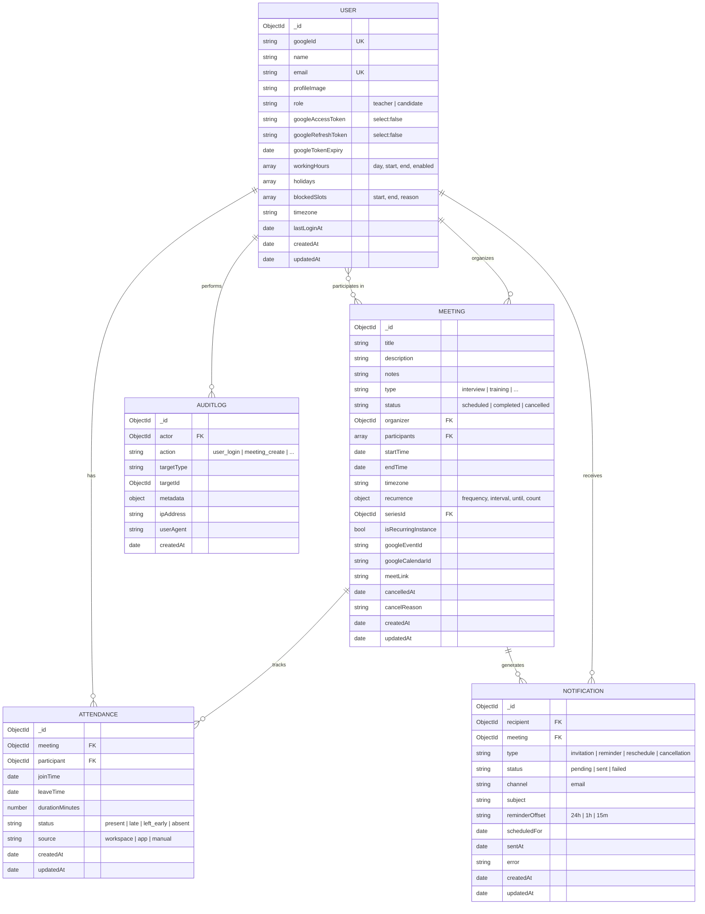

# Database Design — ER Diagram

MongoDB (document) collections and their relationships. The diagram renders on GitHub.

## Notes

- **Unique indexes:** `User.googleId`, `User.email`, and `Attendance(meeting, participant)` (one record per participant per meeting).
- **Compound indexes:** `Meeting(organizer, startTime)`, `Meeting(participants, startTime)`, `Meeting(status, startTime)` for the dashboard and list queries.
- **Recurring meetings** are expanded into one document per occurrence, linked by `seriesId`; each occurrence has its own Google event and Meet link.
- **Google tokens** on `User` are stored with `select:false` and stripped from JSON responses.
